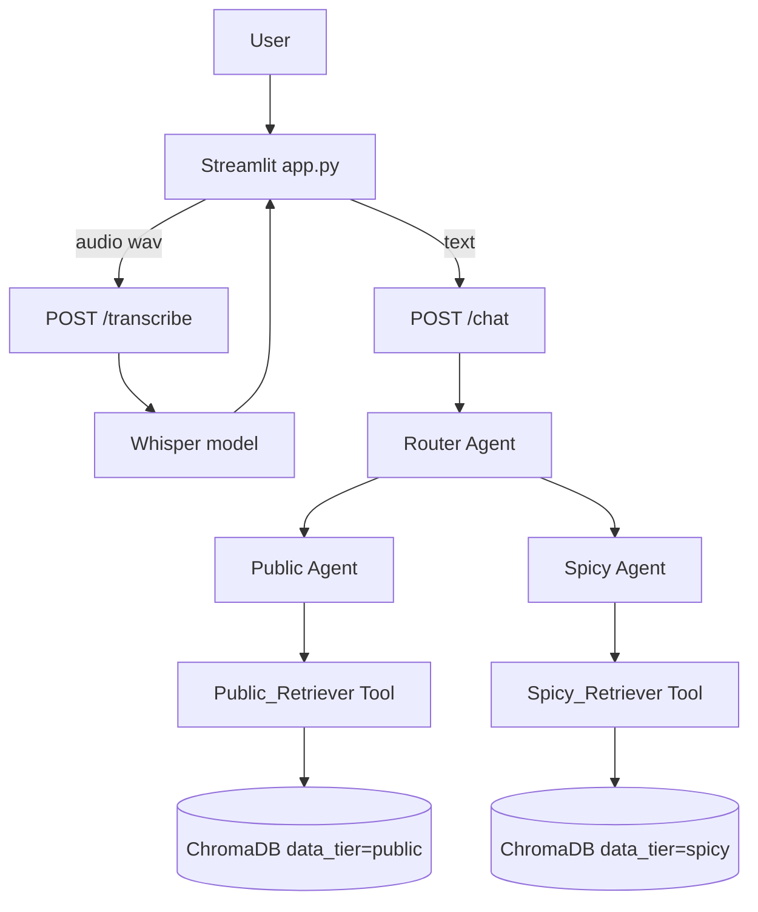

# Akinator PDAI

Akinator PDAI is a voice-enabled, multi-agent guessing game app built with FastAPI + Streamlit + LangChain.
It supports free-form user answers (not only yes/no), routes reasoning across Public vs Spicy data tools, and uses Groq for low-latency model inference.

## What This Repository Contains

- A Streamlit UI for text + voice input
- A FastAPI backend with two endpoints:
    - `POST /transcribe` for Whisper speech-to-text
    - `POST /chat` for the LangChain multi-agent game loop
- A ChromaDB local vector store with two logical data tiers:
    - `public`
    - `spicy`
- Ingestion + enrichment scripts from TSV + LinkedIn + custom gossip

## Quick Start (Local Device)

Use these steps exactly on a new machine.

1. Clone the repository.

2. Create/activate your Python environment (example with micromamba):

```bash
micromamba create -n Akinator python=3.11 -y
micromamba activate Akinator
```

3. Install dependencies:

```bash
pip install -r requirements.txt
pip install langchain-groq
```

4. Create a `.env` file in the project root with your Groq key:

```dotenv
GROQ_API_KEY=your_groq_api_key_here
```

5. Run backend (terminal 1):

```bash
uvicorn main:app --reload --port 8000
```

Wait until backend logs show:
- `Started server process`
- `Application startup complete`

6. Run frontend (terminal 2):

```bash
streamlit run app.py
```

7. Open the Streamlit URL and test with a prompt like:
- `start the game`

## Important Runtime Notes

### 1) Generated Files Are Expected

Some folders are intentionally not committed and will be regenerated locally:

- `chroma_db/`: local Chroma persistence
- `temp_audio/`: temporary audio files
- `__pycache__/`, `*.py[cod]`: Python artifacts

These are ignored in `.gitignore` on purpose.

### 2) ChromaDB Behavior in Current Code

`database.py` currently resets and reseeds the collection with dummy docs on backend startup via `init_db()`.
That means local ingestion data can be replaced on app boot unless you modify this behavior.

If your teammate wants persistent ingested data from `data_processing.py`, they should review and adjust `init_db()` first.

### 3) Groq Key Requirement

`/chat` relies on Groq through `ChatGroq`.
Without a valid `GROQ_API_KEY` in `.env`, chat will fail.

## System Architecture

### High-Level Flow



### LangChain Agent Topology

- `Router Agent` (`conversational-react-description`)
    - Has memory (`ConversationBufferMemory`)
    - Decides when to use Public or Spicy sub-agent tools
- `Public Agent` (`zero-shot-react-description`)
    - Uses `Public_Retriever`
- `Spicy Agent` (`zero-shot-react-description`)
    - Uses `Spicy_Retriever`
- Parsing guardrails:
    - `handle_parsing_errors=True` enabled on all agents

### Model Stack

- Chat model: Groq via `langchain-groq`
- Model id in code: `llama-3.1-8b-instant`
- Embeddings: `all-MiniLM-L6-v2`
- Vector DB: Chroma local persistent client
- Speech-to-text: `openai/whisper-tiny` via Transformers pipeline

### Backend Endpoint Responsibilities

- `POST /transcribe`
    - Receives uploaded audio
    - Stores temporary WAV in `temp_audio/`
    - Runs Whisper transcription
    - Returns text

- `POST /chat`
    - Uses prebuilt router in app state
    - Invokes multi-agent chain
    - Returns `{"reply": ...}`

### Startup Lifecycle (`main.py`)

On FastAPI startup:

1. `init_db()` is called
2. master router is built once (`build_master_router()`)
3. router is cached in `app.state.master_router`

This avoids request-time heavy initialization and reduces 500/latency issues.

## Data & Ingestion Pipeline

### Source Files

- `survey_responses.tsv`: class survey data
- `gossip.py`: custom spicy facts dictionary
- `data_processing.py`: enrichment + ingestion script

### Enrichment

`data_processing.py` can call a RapidAPI LinkedIn endpoint to enrich profile data.

Important: The script currently includes a hardcoded RapidAPI key/host and profile mapping. Teammates should externalize credentials before production use.

### Insert Strategy

For each person, two chunks are built:

- Public chunk (`data_tier=public`)
- Spicy chunk (`data_tier=spicy`)

Each chunk is inserted with metadata including `person` and `data_tier`.

## Project File Guide

- `app.py`: Streamlit UI and backend request handling
- `main.py`: FastAPI app, startup initialization, route handlers
- `langchain_agents.py`: prompts and agent constructors
- `database.py`: Chroma init/access logic
- `data_processing.py`: TSV + LinkedIn + gossip ingestion
- `gossip.py`: hand-maintained spicy knowledge base
- `whisper_model.py`: transcription model setup
- `requirements.txt`: base dependencies

## Collaboration / Claude Handoff Notes

If someone continues development with Claude, they should know:

1. The app uses LangChain Classic agent APIs (`initialize_agent`) and custom tools.
2. Router memory is session-local in process memory; restarting backend resets memory.
3. DB reset behavior is currently aggressive (`init_db` deletes/recreates collection).
4. `.env` is required locally and ignored in git.
5. Runtime-generated folders (`chroma_db`, `temp_audio`) are intentionally ignored.
6. Frontend errors can be generic if backend is down or `/chat` fails.

Suggested first refactors for maintainability:

1. Move all secrets (Groq, RapidAPI) to environment variables.
2. Split config constants into a dedicated config module.
3. Add structured logging and explicit exception responses in `/chat`.
4. Decide whether startup should reset DB or preserve ingested data.

## Troubleshooting

### `Backend is not running` in Streamlit

Usually means one of:

- FastAPI is not started
- FastAPI startup failed
- `/chat` returned a server error

Check backend logs first.

### `Connection refused` to `localhost:8000`

Start backend and wait for `Application startup complete` before using Streamlit.

### Slow or failing first request

Ensure Groq key is valid and internet access is available.

### Authentication issues

Verify `.env` contains:

```dotenv
GROQ_API_KEY=...
```

and restart FastAPI after editing `.env`.

## Security Notes

- Never commit `.env`.
- Rotate any API key that was shared in chat/screenshots.
- Avoid hardcoding external API secrets in source code.
