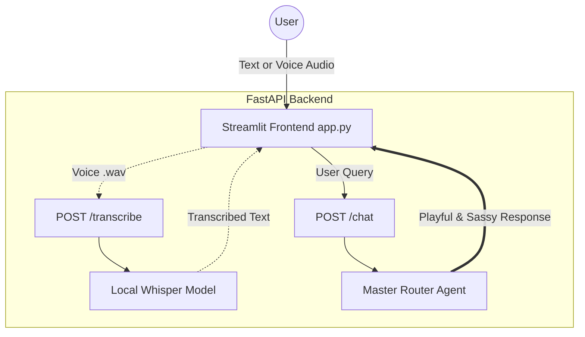

# 🧞‍♂️ Akinator PDAI

Welcome to the **Akinator PDAI**! This is a wildly entertaining, playful, and sassy AI Agent built with LangChain, FastAPI, and Streamlit. It possesses comprehensive knowledge of your classmates' public professional profiles and deeply personal, juicy gossip. It even features voice-recognition so players can speak to the Akinator!

---

## 🏗️ Architecture

The backend utilizes an advanced LangChain Agent architecture with a **Master Router Agent** that determines whether a user's question is "Public/Professional" or "Spicy/Secretive", hitting the respective local ChromaDB vector store accordingly.

### 🌊 System Flowchart



### 🧠 LangChain Agent Architecture

```mermaid
graph TD
    User[User Query] --> MasterRouter[Master Router Agent]
    MasterRouter -- Decision --> PublicAgent[Public Profile Agent]
    MasterRouter -- Decision --> SpicyAgent[Spicy Info Agent]

    subgraph LLM [Language Model: gpt-3.5-turbo]
        MasterRouter -.->|Reasoning & Routing| LLM
        PublicAgent -.->|Reasoning & Answering| LLM
        SpicyAgent -.->|Reasoning & Answering| LLM
    end

    PublicAgent -- Uses Tool --> PublicTool[tool: Public_Retriever]
    SpicyAgent -- Uses Tool --> SpicyTool[tool: Spicy_Retriever]

    subgraph Embedding [SentenceTransformerEmbeddings]
        PublicTool --> Embed[all-MiniLM-L6-v2]
        SpicyTool --> Embed
    end

    subgraph Vector Database [ChromaDB]
        Embed --> ChromaP[(ChromaDB Filter: <br>data_tier=public)]
        Embed --> ChromaS[(ChromaDB Filter: <br>data_tier=spicy)]
    end
    
    ChromaP -.->|Context| PublicAgent
    ChromaS -.->|Context| SpicyAgent
    
    PublicAgent -.->|Synthesized Answer| MasterRouter
    SpicyAgent -.->|Synthesized Answer| MasterRouter
```

---

## 🛠️ Components

- **`app.py`**: The Streamlit frontend. It accepts text or voice recordings (powered by `audio-recorder-streamlit`).
- **`main.py`**: The FastAPI backend connecting the frontend to the LangChain logic and Whisper transcription models.
- **`whisper_model.py`**: Uses the HuggingFace `transformers` pipeline (`openai/whisper-tiny`) to locally transcribe voice to text.
- **`langchain_agents.py`**: Contains the System Prompts and initializes the LangChain Router, Public Agent, and Spicy Agent.
- **`data_processing.py`**: The main ingestion script. It reads your raw TSV survey data, dynamically scrapes Live LinkedIn profiles using the RapidAPI, and formats everything for ChromaDB.
- **`gossip.py`**: Contains the hard-coded dictionary of juicy rumors and inside jokes mapped to everyone's names.
- **`database.py`**: Controls the local ChromaDB initialization.

---

## 🚀 Setup & Installation

**1. Activate your Conda/Micromamba Environment**
Ensure your dependencies are installed:
```bash
micromamba activate Akinator
pip install -r requirements.txt
```

**2. Set up API Keys**
You need two API tokens for this project:
- A Hugging Face token (`HUGGINGFACEHUB_API_TOKEN`) inside a `.env` file for the LangChain capabilities.
- The RapidAPI key is already hardcoded into `data_processing.py`.

---

## 📚 How to Run

### Step 1: Ingest the Data (Run ONCE)
*Only run this the very first time, or if you update `survey_responses.tsv` or `gossip.py` with new info.*

Before starting the app for the first time, you must build the RAG's brain. Run the ingestion script (Ensure you are subscribed to the RapidAPI free tier as discussed!):
```bash
python data_processing.py
```
This scrapes LinkedIn profiles, reads the dirty laundry from the `gossip.py` file, and saves it into the ChromaDB vector database.

### Step 2: Start the Backend Server (Run EVERY TIME)
*This is the brain. It must be running in the background to play.*

Open a terminal, activate your environment, and start the FastAPI server:
```bash
uvicorn main:app --reload
```

### Step 3: Start the Frontend UI (Run EVERY TIME)
*This is the face of the agent.*

Open a second terminal, activate your environment, and spin up Streamlit:
```bash
streamlit run app.py
```

Your browser will pop open and the Akinator will be ready to roast your friends! 🎙️✨
